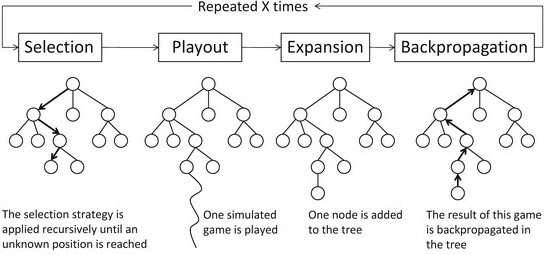
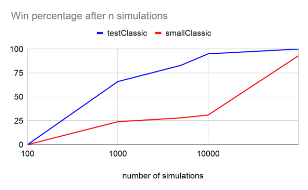
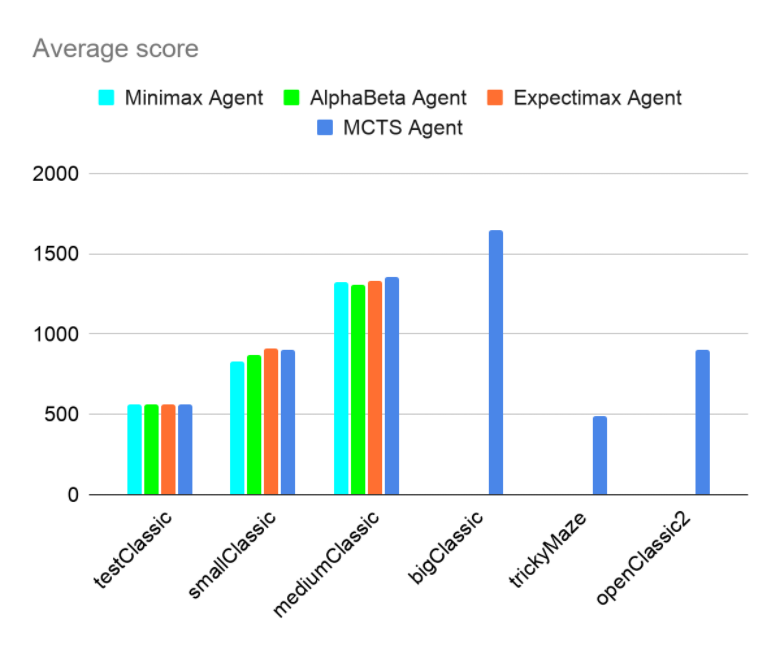
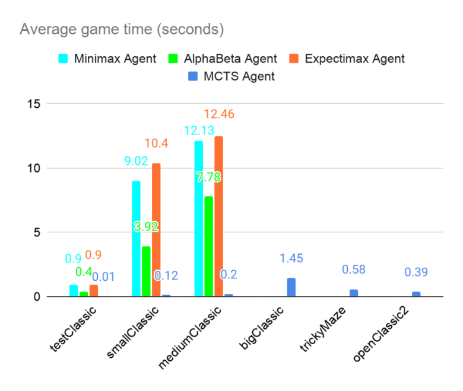
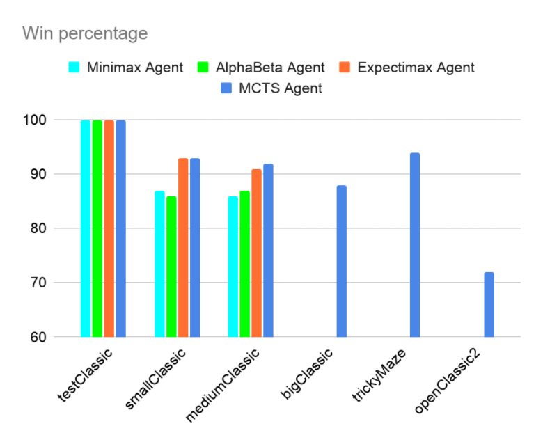

# Model-Based Monte Carlo Tree Search for Pacman

Authors: [@chiragvartak](https://github.com/chiragvartak), [@NeilFranks](https://github.com/NeilFranks), [@fmendoz7](https://github.com/fmendoz7)  
GitHub repository: [monte-carlo-Pacman](https://github.com/chiragvartak/monte-carlo-Pacman)  
Video demonstration: [Monte Carlo Pacman](https://www.youtube.com/watch?v=rvm8Kqri2sM)

## Abstract

In the past few years, the Monte Carlo Tree Search,
has yielded exceptional results in two-player board games. In
this project we use the Monte Carlo Tree Search algorithm to
play the game of Pacman. Using a model-based version of the
original algorithm, we show that even with very limited domain
information, the MCTS easily outperforms other adversarial
search algorithms like Minimax and Expectimax. Our results are
presented for several different types of layouts to show that with
a minimal feature-based representation, MCTS works effectively
well on previously unseen, drastically different maps.

## Introduction

Tree search based algorithms have been shown to give
good results for two-player zero-sum games. Algorithms like
Minimax explore the game tree to find the best moves that
lead to winning positions. However, Minimax, even with
optimisation techniques like Alpha-Beta pruning, has several
limitations, and requires a huge amount of computational
resources, due to the fact that it must explore a significant
amount of the game tree, if not all of it (without Alpha-Beta
pruning). It assumes that the opponent is perfectly rational; it
will always play a perfect game and it always plans for worst
case scenarios. Minimax, along with Expectimax, also relies
on a good state evaluation function, which is challenging to
implement and is only effective to a certain depth \[1] .

While such tree search algorithms were responsible for beating the world's top players in certain games with a relatively
limited branching factor, (chess possessing 10123 possible
moves), such algorithms could not best other games with
a sufficiently high branching factor (such as Go, possessing
10360 possible moves \[2]). This explains how IBM's DeepBlue
computer infamously bested Garry Kasparov in the game of
Chess utilizing the Alpha-Beta tree search algorithm, but how
AI research was unable to produce a sufficiently rigorous and
consistent approach to best the game of Go nineteen years
after DeepBlue's victory.

In recent years, several Monte-Carlo tree search algorithms \[3]
have emerged and have been deployed successfully in several
games. This allowed DeepMind's AlphaGo to best the reigning
world champion of Go, Lee Sedol, by 4-1. AlphaGo's successor, AlphaZero, bested its predecessor in an adversarial set of
games, by 100-0. Since the game of Pacman is much smaller
in the total number of actions possible on any layout and
due to its domain-independent nature, Monte Carlo can very
easily clear it; without relying on the excessive computational
power required by other algorithms. For this project, we
have implemented a model-based derivative of Monte Carlo
Tree Search, which can learn well with a small number of
simulations.

## Motivation

The Monte Carlo Tree Search \[4] is superior to previous algorithms, as it is able to make its own evaluation function through
sufficient experience and is domain-independent, allowing it to
be deployed in a variety of games. As outlined in the figure below,
Monte Carlo Tree Search is comprised of four steps: Selection,
Playout, Expansion, and Backpropagation.

Fig. 1: Monte Carlo Tree Search Process [4]

It is intended to
learn to play a game by itself with only the state information
given, and through multiple simulations, the search gives
us the best moves for a particular state. The drawback to this,
however, is that, many times, a large number of simulations
are required to achieve a decent performance. This implies the
need for huge computational power. Our aim in this project
was to find a way to design a version of MCTS that would do
reasonably well even with a relatively small number of simulations. We did not plan to rely on raw computational power
to achieve good performance. This imposed some constraints
on us, such as the feature state space could not be unfeasibly
large. Pure MCTS would require exponentially more time to
explore a reasonable amount of states the required number of
times, so we elected to modify pure MCTS into a model-based
MCTS in our project.

## Technical Approach

The Monte Carlo Tree Search relies on repeated simulations
of the game to heuristically explore states that it finds more
promising. Because during a simulation "rollout" it plays the game
all the way to the end, it does not rely on an evaluation function
to differentiate between good and bad states. Even so, it does
suffer from limitations for the Pacman game domain. Within
the initial stages of development, we first tried to implement
a pure Monte Carlo Tree Search, exactly as it was described
in the paper. We then realized this approach was untenable
for practical development, as the requisite computation to
successfully run Pacman games on large environment sets
would be infeasible within a reasonable amount of time, due
to the limitations of our own individual machines, in stark
contrast to the sheer computational firepower DeepMind's
AlphaGo had to bear from its advanced hardware when it
deployed MCTS.

A Pacman game layout with only two ghosts can have a
branching factor as large as 80 (5 Pacman moves x 4 ghost1
moves x 4 ghost2 moves). Thus, a real-time MCTS \[5], with
limited computational power, will find it difficult to achieve
good results. We then revised our solution, which was based
on the following points:

- **Low-dimensional feature-based game states**: Representing a game state as a set of minimal, smartly-designed
features reduces the game's state space substantially. This
allows the Pacman to use knowledge learnt in one game
state to other similar states.

- **Model-based MCTS**: Running a search for each state
during live game playing is not only time-consuming but
also does not efficiently leverage the features that we
designed. Using a "model-based" MCTS instead allowed
us to train the agent beforehand and use the knowledge
that it gained while playing an actual game.

- **Training on select layouts that effectively explore
the state space**: The simulations can produce poorly performing models that do not fare very well in actual
games. Using certain specially-designed training layouts
enabled the agent to learn a very effective model.

- **Reuse of the monte-carlo simulation game tree**: We
save the simulation results and reuse them across multiple
searches. This greatly reduces computing redundant information, and the incremental performance increase with
each search is significant.

- **Modelling a successor state as a `(parent, action)`
pair**: This small optimisation in the algorithm prevents
recomputing successor states if they are not going to
be explored. This works very well with game tree reuse
described above as a lot of the computational overhead
is lessened.

- **Heuristic To achieve faster wins**: Exploitation of existing simulations is necessary for the Pacman to explore
promising game states. But the simulations in the Pacman
domain mostly result in losses initially and the agent
very rarely wins. It takes a long time for the agent to
explore enough states to start winning. We remedied this
by giving the exploitation a boost by lightly guiding the
Pacman to win by making a promising move with an increased
probability.

- **Modification of the original UCT formula**: As we
increased the exploitation above, we discovered that the
exploration suffered greatly. This was fixed by modifying
the original UCT formula to:

## Results, Analyses and Discussions

To measure the effectiveness of out approach, we implemented an MCTS agent which chose its actions according to
a model we provided it with. To obtain the model, we had to
run training simulations. The training was done on a custom
layout that was very small and simple, which allowed many
simulations to be done in a short period of time. Because
the dimensionality of the feature-based games states were so
low, this simple layout below was able to produce every unique state
that the model was capable of seeing.

Fig. 2: One of the training layouts used by the MCTS agent

To prove that the simple layout was capable of producing
every possible game state, we must first discuss how our
feature-based game state is computed. First, we feed the raw
game state into a function which extracts just two features:

- A categorical feature representing the first move to make
in order for Pacman to get to the nearest food (this is determined using A-star search)
- A binary feature representing whether a ghost is present
in the immediate vicinity of where Pacman will be if he
makes the move specified by the categorical feature described above

With the categorical feature having 4 possible values, and
the binary having 2, that gives us eight combinations. But
our full feature-based game state recorded a game state as
the combination of these two features along with the actual
action Pacman took. Given any combination of the categorical
and binary features, the Pacman could choose to make one of 5
moves (`North`, `South`, `East`, `West`, and `Stop`), so the
total number of unique feature-based game states is 40. It is
expected that our model-based Monte Carlo implementation
would explore all forty of these states quickly, and we were
able to confirm that all forty of them are eventually represented
by querying a model that was trained on 10,000 simulations.
As an aside, we queried this model for the node which had
the most and least visits, and the most and least wins:

- **Most visits (4,979) and most wins (164 wins)**: a node
denoting Pacman wanted to go North, and there was no
ghost in the area, so he went North
- **Least visits (11) and 2 wins**: a node denoting Pacman
wanted to go East, but there was a ghost in the area, but
he went East anyway
- **Least wins (1) and 17 visits**: a node denoting Pacman
wanted to go East, but there was a ghost in the area, so
he stopped

From this information, we can draw a conclusion that our
algorithm, using our modified UCT formula, is performing
well in terms of balancing exploration and exploitation, a
crucial element of MCTS. Furthermore, we can confirm the
data contained in the model makes sense intuitively, especially since the simple custom layout we used to train on was
predisposed to expose Pacman situations where the nearest
food was to the North, and least of all to situations where the
nearest food was to the East (see Fig. 2). Though this layout functioned
successfully as a training ground, in future implementations
we would employ this layout in conjunction with rotated
and transposed versions of it in our training, to give Pacman
roughly equal exposure to all possible states. It stands to reason
that if we had done this, we may have obtained successful
models even more quickly than we did.

Additionally, with our game state being characterized by
these features, it was possible to train a model on a layout
containing just one ghost, and apply it to layouts with two,
three, or four ghosts.

After training on the simple-and-fast custom layout, we then
measured our agent's win percentage for 100 "real" games,
using a model trained on 100, 1,000, 5,000, 10,000, and
100,000 simulations. These real games were played on two
different layouts: a very simple layout `testClassic`
which has wide open space and one ghost, and a more
complex layout `smallClassic` which has twists, turns, tight
spaces, and two ghosts.

testClassic and smallClassic side by side images

It is clear from the results below
that the model's performance continuously improved as it was
subjected to further training, with an especially significant
improvement from 10,000 to 100,000 simulations on the more
complex `smallClassic`. After 100,000 training simulations, a
model allowed our MCTS Agent to play `testClassic` and
`smallClassic` with 100% and 93% accuracy respectively.
Running 100,000 training simulations took roughly 30
minutes.

Furthermore, an MCTS Agent with 100,000 training simulations
drastically out-performed agents using Minimax, AlphaBeta, and Expectimax algorithms (all using depth=3) in terms
of average score, average time per game, and win percentage.
The difference was most striking in average time per game;
model-based MCTS consistently took a fraction of the time the
other algorithms took to compute. As a result, on large layouts
where Minimax, AlphaBeta, and Expectimax agents timed out
after 30 seconds, the MCTS Agent was able to finish, and
receive high scores.

In the graphs shown above, no bar is presented if the agent timed
out after 30 seconds on the layout. The `mediumClassic` and
`bigClassic` layouts are incrementally larger layouts containing two ghosts. The `trickyMaze` layout is a large winding
layout containing one ghost and no food except for one pellet
placed in each of the far corners. Finally, `openClassic2` is
a large, open space containing lots of food and four ghosts.
Evidently, `bigClassic`, `trickyMaze`, and `openClassic2` became too computationally expensive for any agent to compute
within a 30-second timeout, other than the MCTS agent. This
points to a key take-away regarding our implementation of a
model-based MCTS: if we took the time to train a sufficient
model, then the games could be completed much more
quickly and effectively than could be done using the real-time
algorithms which we compared against.

## Conclusions and Discussions

In summary, our research highlighted the utility of Monte
Carlo Tree Search, its fundamental design tenets that enabled
it to succeed in a wide variety of more open-ended games,
and how we were able to successfully modify it in the form
of a model-based MCTS to not just clear many layouts of the
Pacman game which the model had not seen during training,
but to achieve high scores at a much quicker pace compared to
the agents employing Minimax, AlphaBeta, and Expectimax
algorithms. We did not find a layout that was able to stump our
MCTS agent, due to the clever design of feature-based game
states and its applicability to any conditions. Finally, though
we have demonstrated the effectiveness of our design and
training process, during analysis we identified a key area where
our training process may be improved; namely, by training on
combinations of rotated and transposed versions of the training
layouts.

## References

[1] Norvig, P. and Russel S. *Artificial Intelligence: A Modern Approach*.
Prentice Hall, (2002): 163–171

[2] Gelly, Sylvain, et al. "The grand challenge of computer Go: Monte Carlo
tree search and extensions." *Communications of the ACM* 55.3 (2012):
106-113.

[3] Browne, Cameron B., et al. "A survey of monte carlo tree search
methods." *IEEE Transactions on Computational Intelligence and AI in
games* 4.1 (2012): 1-43.

[4] Chaslot, Guillaume, et al. "Monte-Carlo Tree Search: A New Framework
for Game AI." *AIIDE*. 2008

[5] Pepels, Tom, Mark HM Winands, and Marc Lanctot. "Real-time monte
carlo tree search in ms pac-man." *IEEE Transactions on Computational
Intelligence and AI in games* 6.3 (2014): 245-257.
